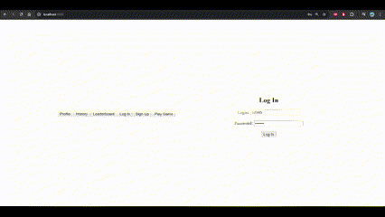
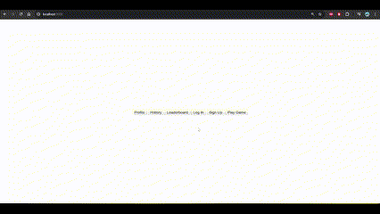

# TicTacToe

**TicTacToe** — это веб-приложение для игры в крестики-нолики. Играть можно как против компьютера (алгоритм минимакс), так и с другим пользователем. Реализована регистрация и авторизация с использованием JWT.

## Возможности
- **Игра против компьютера**: использован алгоритм минимакс для оптимального поведения ИИ.
- **Игра против другого пользователя**: сетевая многопользовательская игра.
- **Регистрация и авторизация**: безопасная аутентификация с помощью JWT.
- **Современный интерфейс**: клиентская часть построена на JS, HTML и CSS.

## Стек технологий
- **Back-end**: Flask, SQLAlchemy, PostgreSQL.
- **Front-end**: JavaScript, HTML, CSS.
- **Авторизация**: JWT (JSON Web Token).

## Установка и запуск проекта

   1) Cоздать .env с нужными аттрибутами для config.py
   2) ```bash
      python -m venv venv
      source venv/bit/activate
      pip install -r requirements.txt
      python app.py

## Игра с компьютером (алгоритм Минимакс)



## Игра с пользователем (Short Polling)


